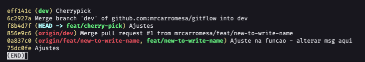
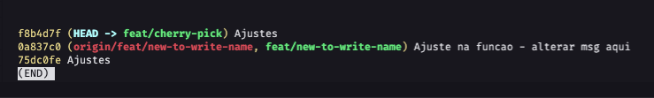
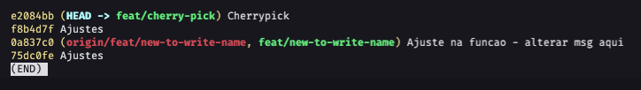

# Cherry-pick

- Utilizamos esse comando quando por exemplo realizamos um commit na branch errada e queremos trazer esse commit para branch correta;
- Ou quando tem uma funcionalidade especifica em outra branch que queremos trazer para nossa

- Para tal realizamos o git log:

```shell
git log --oneline NOME_DA_BRANCH_DE_ORIGEM
```

- Ex.: temos duas branchs a dev e a feat/cherrypick

- E queremos trazer um commit da dev para a branch feat/cherrypick

- Realizamos o comando:

```shell
git log --oneline dev
```

- Ela está assim:



- Queremos utilizar o commit eff141c no caso o primeiro,

- O qual podemos ver utilizando o comando de log não temos ela na nossa branch feat/cherry-pick:

```shell
git log --oneline feat/cherry-pick
```



- Para realizarmos o procedimento:

- Devemos estar na branch destino, nesse caso a feat/cherrypick
- E executar o comando passando o commit que queremos copiar:

```shell
git cherry-pick NR_DO_COMMIT
```

No caso como sabemos que o commit é eff141c, colocamos assim

```shell
git cherry-pick eff141c
```

- Feito isso podemos verificar nos logs novamente:

```shell
git log --oneline feat/cherry-pick
```



- E o nosso commit está nessa branch!

