# Rebase

- Obter logs:

```shell
git log --oneline
```

---

- Remover um arquivo do Staging area:

```shell
git reset PATH_FILE
```

ou para todos

```shell
git reset HEAD -- .
```

- Realizar o rebase:

Utilizando o comando de log:

```shell
git log --oneline
```

vamos obter os commits

devemos contar quantos queremos unir:

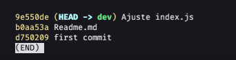

e unir de forma interativa com o seguinte comando:

```shell
git rebase -i HEAD~Quantidade de commits
```

```shell
git rebase -i HEAD~3
```

Ou se for para voltar até o primeiro commit só executar o comando:

```shell
git rebase -i --root
```

podemos utilizar os comandos p e s

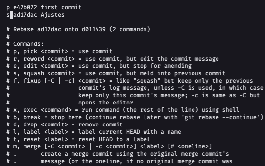

onde p é o commit que queremos preservar e o s é os que queremos espremer

porfim resultando em um único commit:

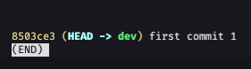

---

## Reverter alterações com o rebase

- Também é possível reverter (removendo commits):

- Utilizar o comando:

```shell
git rebase -i HEAD~QUANTOS_COMMITS_ATRAS
```

ex:

```shell
git rebase -i HEAD~3
```

- Esse comando irá listar 3 commits atrás, e irá exibir em um editor:

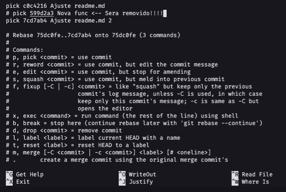

- Perceba que um dos commits está com '#' na frente, esse commit será removido da história ou seja todas as alterações feitas por esse commit deixarão de existir 


---

## Facilitar leitura da historia dos commits

- Observe esse caso:

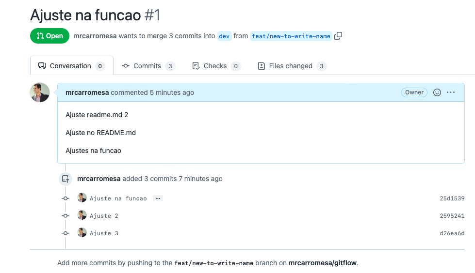

- Temos vários commits na PR, o ideal para deixar a história linear é espremer todos os commits deixando apenas 1 pois não precisamos saber das tentativa-erro do dev, apenas precisamos da nova solução implementada por ele, dessa forma podemos utilizar o rebase para reduzir todos os commits para apenas 1.

- Detalhe importante é que antes de fazer isso, é necessário estar com seu workspace limpo, caso tenha arquivos pendentes para realizar commit é necessário realizar o commit deles ou descarta-los.

- Feito isso primeiro vamos analisar o log:

```shell
git log --oneline
```

- Ele irá exibir 4 commits nesse caso, que são os commits da imagem anterior, e um commit da branch de dev, que seria o primeiro commit...

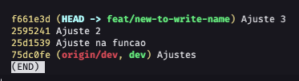

- Vamos então pegar apenas os `3` commits:

```shell
git rebase -i HEAD~3
```

- Ele irá exibir o seguinte:

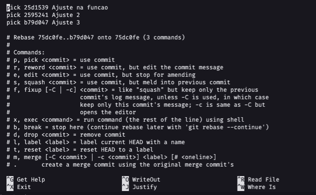

- Podemos deixar um commit com `pick` ou `p` na frente, e podemos espremer os demais colocando `s` na frente

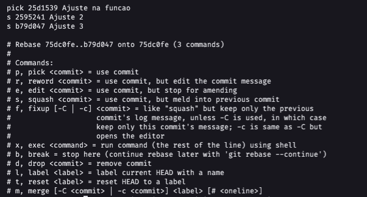

- Feito isso e salvando as alterações a próxima tela irá mostrar o commit, vc pode alterar a msg do commit!

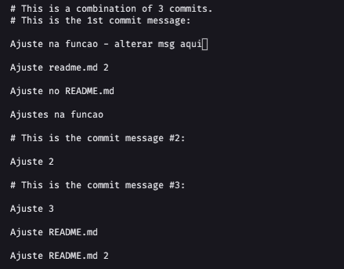

Observe que foi alterada a msg onde está `- alterar msg aqui`, vc pode modificar todo esse arquivo deixando a msg que desejar!

- Salvar o arquivo.

- Por fim executando o comando:

```shell
git log --oneline
```

- Vc verá que seus 3 commits agora são apenas 1!


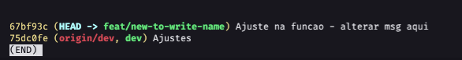

- Por fim, como a história foi modificada, ao dar o push será necessário colocar o `-f` para conseguir enviar as alterações.

```shell
git push -f
```

- Por fim a PR ficou assim:

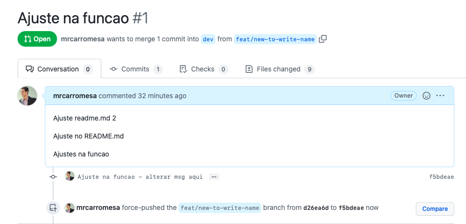